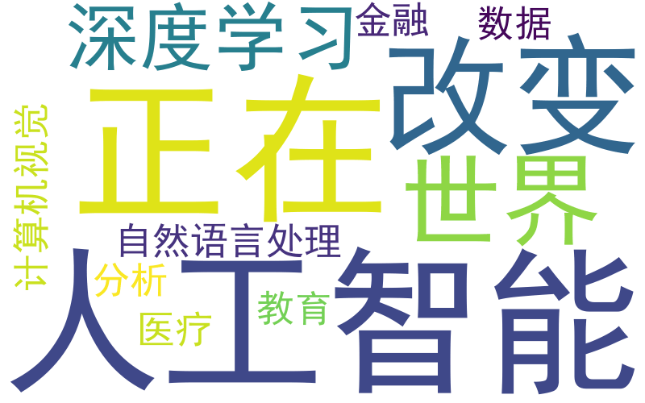

# KeywordCloudAI

**AI 可视化关键词云创作平台**

---

## 项目简介
这是一个基于 Python + NLP 的关键词云生成系统，支持中文文本分析、关键词提取和词云可视化。
用户可自定义配色方案，并将生成的词云用于 PPT 和报告。

> 本项目由人工智能专业本科生 丁学郅 独立完成

---

## 项目演示

---

## 技术栈
- Python
- NLP
- WordCloud
- 可视化分析

---

## GitHub
https://github.com/你的GitHub用户名/KeywordCloudAI